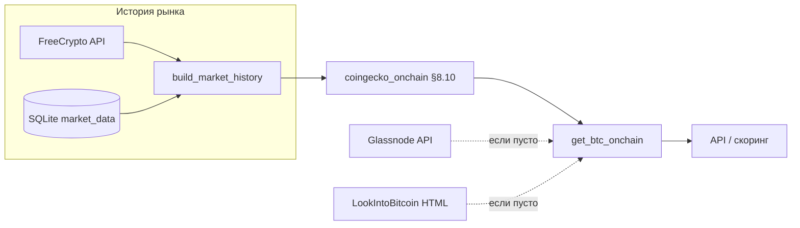

# Откуда берутся MVRV / NUPL / SOPR и как они считаются в BitTrend

Документ описывает **фактическую** логику в коде (не «учебниковые» определения с Glassnode). Точка входа для ончейн-блока — `get_btc_onchain()` в `bit_trend/data/onchain.py`.

## Порядок источников

1. **Основной путь (по умолчанию)** — прокси по **plan.md §8.10**, модуль `bit_trend/data/coingecko_onchain.py`. Входной ряд — **`build_market_history("BTC", …)`** из `bit_trend/data/market_source.py` (история primary-провайдера рынка, по умолчанию **CoinMarketCap** при `MARKET_DATA_PRIMARY=cmc`, плюс слияние со снимками SQLite `market_data`). Флаг `USE_COINGECKO_ONCHAIN` (по умолчанию `true`): при `false` прокси не строится.
2. **Дозаполнение пропусков — Glassnode** — только при `USE_GLASSNODE=true` и заданном `GLASSNODE_API_KEY`. Подставляются только **пустые** поля из шага 1. Эндпоинты: `market/mvrv_z_score`, `indicators/nupl`, `indicators/sopr`, дополнительно `market/mvrv` и потоки на/с бирж.
3. **Дозаполнение пропусков — LookIntoBitcoin** — только при `USE_LOOKINTOBITCOIN=true`. Парсинг HTML страниц `bit_trend/data/lookintobitcoin.py`:  
   - `https://www.lookintobitcoin.com/charts/mvrv-zscore/`  
   - `https://www.lookintobitcoin.com/charts/nupl/`  
   - `https://www.lookintobitcoin.com/charts/sopr/`  

Параллельно `onchain.py` всегда может подтянуть **Blockchain.com** (`api.blockchain.info`) для числа транзакций и графика уникальных адресов — это **не** замена тройке MVRV/NUPL/SOPR.

Требования к длине истории для прокси: после `build_market_history` нужно не меньше **`ONCHAIN_PROXY_MIN_ROWS`** осмысленных строк с ценой и капитализацией (по умолчанию **180**; для окон `rv_730` в формулах желательно **730+** дней).

При **`MARKET_DATA_PRIMARY=cmc`** и **`CMC_API_KEY`** длинный ряд приходит с CoinMarketCap (quotes + OHLCV) и сливается со снимками SQLite `market_data`. Первичный бэкфилл таблицы: `python scripts\import_cmc_btc_history.py` (или `python scripts\import_cmc_btc_history.py --days 730`) после настройки ключа. Без ключа и без накопленных снимков `collect_daily_snapshot` окно может быть коротким или пустым.

---

## Прокси §8.10 (`coingecko_onchain.py`) — как именно считаются числа

Вход: ежедневные `price`, `market_cap`, `volume` (индекс — время UTC). Если у источника нет `market_cap`, он оценивается как `price × ONCHAIN_PROXY_BTC_SUPPLY_EST` (по умолчанию 19 500 000).

**Вспомогательные величины**

- `supply = market_cap / price`
- **«Реализованная стоимость» (прокси)** через скользящие средние цены:
  - `rv_180 = SMA_180(price) × supply` (min_periods 60)
  - `rv_365 = SMA_365(price) × supply` (min_periods 90)
  - `rv_730 = SMA_730(price) × supply` (min_periods 180)
- **Смесь RV:** `rv_mix = 0.5×rv_730 + 0.3×rv_365 + 0.2×rv_180`

**MVRV proxy**

\[
\text{mvrv\_proxy} = \frac{\text{market\_cap}}{\text{rv\_mix}}
\]

**NUPL proxy**

\[
\text{nupl\_proxy} = \frac{\text{market\_cap} - \text{rv\_730}}{\text{market\_cap}}
\]

**SOPR proxy (поведенческий)** — не ончейн-SOPR:

- `ma30 = SMA_30(price)`, `price_vs_ma = price / ma30`
- `vol_ma = SMA_14(volume)`, `volume_change = volume / vol_ma`
- `ma365 = SMA_365(price)`
- `sopr_simple = price / ma365`
- `sopr_proxy = price_vs_ma × volume_change`

Дополнительно для композита считаются `volatility_30d`, `drawdown` и их z-ряды (см. тот же модуль).

**Скользящий z-score** для произвольного ряда `x` (как в коде `rolling_z`):

\[
z_t = \frac{x_t - \mu_t}{\sigma_t}
\]

где \(\mu_t\), \(\sigma_t\) — скользящее среднее и стандартное отклонение `x` с окном **`z_window`** и **`z_min_periods`** из `bit_trend/config/scoring.yaml` → секция `coingecko_composite` (по умолчанию **365** и **30**; переопределение через env/COMPOSITE_810 смотрите в `loader.py`).

Применение:

- `mvrv_z = rolling_z(mvrv_proxy)`
- `nupl_z = rolling_z(nupl_proxy)`
- `sopr_z = rolling_z(sopr_proxy)`

**Что уходит в `get_btc_onchain()` из прокси** (`_row_to_public_dict`):

| Поле в JSON/API | Откуда берётся (последняя валидная точка ряда) |
|-----------------|--------------------------------------------------|
| `mvrv_z_score`  | **`mvrv_z`** — z-score от **прокси MVRV**, это **не** обязательно тот же числовой ряд, что у Glassnode «MVRV Z-Score». |
| `nupl`          | **`nupl_proxy`**, затем **обрезка** в диапазон **[-0.5, 1.5]**. |
| `sopr`          | Предпочтительно **`sopr_simple`** (`price / SMA_365(price)`); если его нет — **`sopr_proxy`**. |

Мета для UI зависит от `MARKET_DATA_PRIMARY`: при `cmc` — `source` = `coinmarketcap`, `parser_version` = `cmc_ohlcv_sqlite_v1` (слияние OHLCV CMC и SQLite `market_data`); при `freecrypto` — `freecrypto_api` / `freecrypto_market_v1`. `method` = `build_market_history_proxy`, опционально суффикс `+USE_CMC_ONCHAIN` если в `.env` задано `USE_CMC_ONCHAIN=true`. `confidence` / `source_score` — env `COINGECKO_ONCHAIN_CONFIDENCE`, `COINGECKO_ONCHAIN_SOURCE_SCORE`.

---

## Glassnode (при включении)

Значения **последней точки** за короткое окно (в коде запросы с `days=7`) с API `https://api.glassnode.com/v1/metrics/...` подставляются **только если** соответствующее поле после прокси ещё `None`. Для сопоставимости с «классикой» это как раз ближе к привычным ончейн-метрикам Glassnode.

---

## LookIntoBitcoin (при включении)

С страниц графиков извлекаются **готовые** значения MVRV Z-Score, NUPL и SOPR (парсер + опционально Selenium), с **stabilize** по `LOOKINTOBITCOIN_MAX_DELTA_*`, проверкой свежести и `source_score`. Используются только для дозаполнения пустых полей и при достаточной уверенности (`onchain.py` требует `source_score >= 0.4` и `confidence >= 0.5`).

---

## Связь со скорингом

Пороги интерпретации в `bit_trend/scoring/calculator.py` и текстовая интерпретация в `_interpret_onchain` в `onchain.py` завязаны на **числовые поля** `mvrv_z_score`, `nupl`, `sopr` так, как они приходят из цепочки выше (прокси или API).

---

## Краткая схема потока данных

