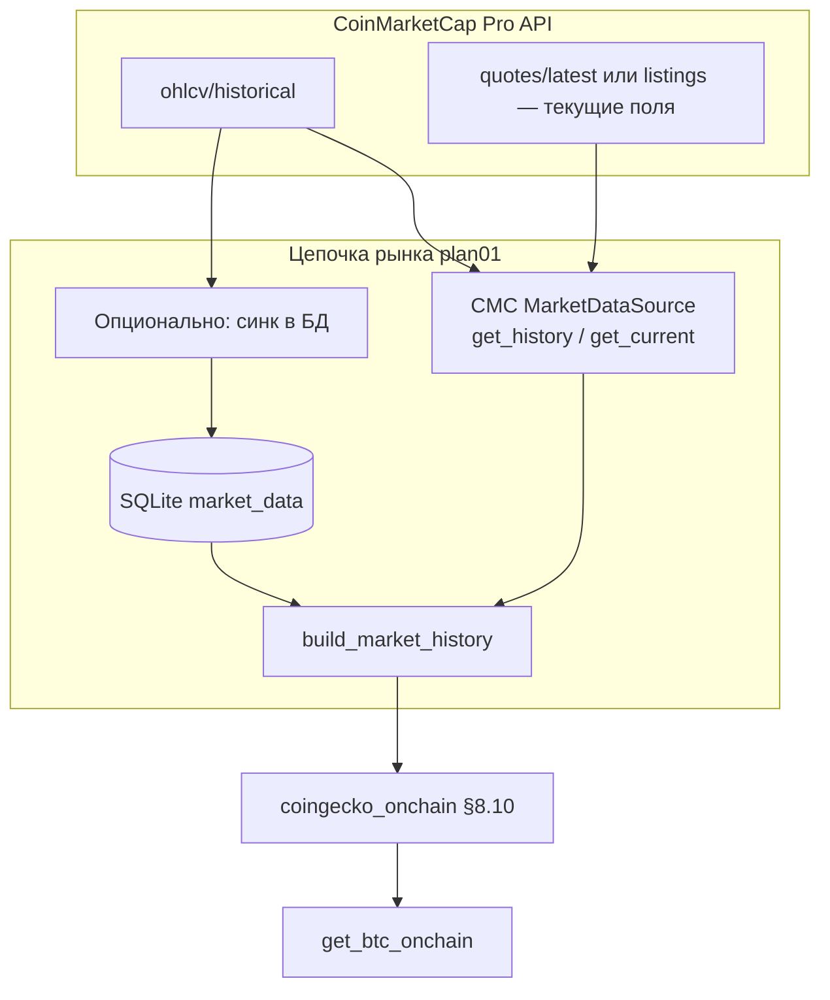

# План замены цепочки прокси MVRV / NUPL / SOPR на данные [CoinMarketCap Pro API](https://coinmarketcap.com/api/)

Документ фиксирует **пошаговый** переход к [CoinMarketCap Pro API](https://coinmarketcap.com/api/) в двух связанных направлениях:

1. **Рыночные данные вместо FreeCrypto** — убрать зависимость от `MARKET_DATA_PRIMARY=freecrypto` и `FREECRYPTO_API_TOKEN`: текущие `get_current` / история `get_history` должны идти через провайдер **CMC** (`market_source.py`, фабрика источников).
2. **Прокси §8.10** — **заполнение `market_data`** историческими дневными котировками CMC (и/или тот же API как `get_history`), после чего формулы в `coingecko_onchain.py` считают MVRV/NUPL/SOPR **без изменения**.

Опционально CoinGecko/Binance остаются в `MARKET_DATA_FALLBACK`, если нужна устойчивость при лимитах CMC.

---

## 0. Контекст: что реально делает код сегодня

| Уровень | Факт в репозитории BitTrend |
|--------|------------------------------|
| Вход прокси §8.10 | `build_market_history("BTC", …)` в `bit_trend/data/market_source.py`: API primary (по умолчанию FreeCrypto) **+** строки SQLite `market_data` за то же окно (`load_market_data_history`). |
| Модуль `coingecko_onchain.py` | Содержит формулы `_enrich_810` и флаги `USE_COINGECKO_ONCHAIN`; **не** тянет CoinGecko `market_chart` для прокси — только для отдельного `CoinGeckoMarketDataSource` в цепочке рынка. |
| Минимум истории | `ONCHAIN_PROXY_MIN_ROWS` (по умолчанию **180**) строк с `price` и `market_cap` после слияния. |
| Таблица БД | `market_data`: `timestamp` (PK), `symbol`, `price`, `market_cap`, `volume`, `source` — см. `bit_trend/data/storage.py`. |

Итого: цель — **CoinMarketCap как основной источник рынка** (вместо FreeCrypto) **и** основной источник длинного дневного ряда для прокси (через API и/или БД).

---

## 1. Целевая архитектура



- **Замена FreeCrypto:** в `.env` выставить `MARKET_DATA_PRIMARY=cmc` (или принятое имя провайдера в коде) и реализовать класс источника с тем же контрактом, что `FreeCrypto`-адаптер: `get_current` / `get_history` → колонки `timestamp`, `price`, `market_cap`, `volume`.
- **Текущие котировки с CMC:** типичный эндпоинт `GET /v1/cryptocurrency/quotes/latest` (параметры `symbol=BTC`, `convert=USD`) — маппинг в поля строки снимка как у остальных провайдеров; при необходимости уточнить по [документации CMC](https://coinmarketcap.com/api/documentation/v1/).
- Достаточно, чтобы за окно `ONCHAIN_PROXY_HISTORY_DAYS` (по умолчанию до 3650) в merge попало **≥ `ONCHAIN_PROXY_MIN_ROWS`** дней с валидными `price` и `market_cap`. `volume` желателен для прокси-SOPR (см. `data-get.md`).

**После замены FreeCrypto:** `FREECRYPTO_API_TOKEN` можно не задавать; `collect_daily_snapshot` продолжит писать в `market_data`, если вызывать его поверх цепочки с CMC-primary — снимки будут с `source`, отражающим новый провайдер.

---

## 2. Данные, которые нужно забирать с CMC

| Назначение | Эндпоинт (типично) | Поля ответа |
|------------|---------------------|-------------|
| История для прокси / `get_history` | `GET /v1/cryptocurrency/ohlcv/historical` | `quotes[].quote.USD.close`, `market_cap`, `volume`; время — `time_close` |
| Текущий снимок / `get_current` | `GET /v1/cryptocurrency/quotes/latest` | `quote.USD.price`, `market_cap`, `volume_24h` (имена уточнить по схеме ответа CMC) |
| Время ряда (история) | — | `time_close` (ISO, UTC) — нормализовать под `load_market_data_history` и `normalize_history_df` |

Таким образом **один и тот же ключ `CMC_API_KEY`** обслуживает и отказ от **FreeCrypto** по цепочке рынка, и дневной ряд для §8.10.

База URL Pro API: `https://pro-api.coinmarketcap.com`  
Документация: [CoinMarketCap API](https://coinmarketcap.com/api/).

Заголовок: `X-CMC_PRO_API_KEY`, при необходимости `Accept: application/json`.

Параметры запроса (пример из ТЗ): `symbol=BTC`, `convert=USD`, `time_start`, `time_end`, `interval=daily`.

**Замечания по внедрению:**

- Уточнить в документации CMC лимиты на длину одного ответа и при необходимости **разбивать окно** на несколько запросов (например блоками по 90–180 дней), с идемпотентной записью `INSERT OR REPLACE`.
- Обработать частичные дыры (праздники, сбои API): логирование и при возможности добор только пропусков.

---

## 3. Запись в `market_data` (согласование с BitTrend)

При вставке строк из CMC нужно выставить:

- `symbol` = `'BTC'` (как в `build_market_history` / `collect_daily_snapshot`).
- `source` = например `'coinmarketcap'` — для отладки и отчётов.
- `timestamp` — нормализованный ISO UTC **одного дня на строку** (как в существующем merge; избегать дублей PK по `timestamp`).

Пример логики (концептуально, под PowerShell окружение проекта):

```powershell
# После настройки CMC_API_KEY в .env — вызов импортера из Python (шаг 6)
Set-Location D:\CursorAI\BitTrend
$env:CMC_API_KEY = "ВАШ_КЛЮЧ"   # или загрузка из bit_trend\config\.env
python -m scripts.import_cmc_btc_history  # имя скрипта по факту реализации
```

Реализация INSERT должна использовать тот же путь, что и остальной код: предпочтительно **функция в `storage.py`** (например батч `save_market_rows` или расширение `save_market_snapshot`), чтобы не плодить разные SQL-диалекты.

---

## 4. Конфигурация (.env)

Добавить и задокументировать в `.env.example`:

| Переменная | Назначение |
|------------|------------|
| `CMC_API_KEY` | Ключ Pro API (общий для quotes + ohlcv). |
| `MARKET_DATA_PRIMARY` | **`cmc`** (или финальное имя в `_source_cls_map`) вместо **`freecrypto`** — основная замена FreeCrypto. |
| `FREECRYPTO_API_TOKEN` | Удалить или оставить пустым после миграции; убрать из обязательных в README. |
| `USE_CMC_ONCHAIN` | `true` — включить загрузку/merge истории CMC для прокси (после реализации). |
| `USE_COINGECKO_ONCHAIN` | `false` — если прокси §8.10 должен опираться **только** на ряд из БД/CMC без «старого» пути; иначе оставить совместимость. |

Дополнительно (по желанию реализации):

- `CMC_OHLCV_HISTORY_DAYS` — глубина синка (согласовать с `ONCHAIN_PROXY_HISTORY_DAYS`).
- `CMC_IMPORT_INTERVAL` — только `daily` для текущего прокси.
- `MARKET_DATA_FALLBACK` — при желании оставить `binance,coingecko` **без** `freecrypto`, если отдельного fallback FreeCrypto больше не будет.

Важно: файл с секретами — `bit_trend/config/.env` (как в ТЗ); не коммитить ключ.

---

## 5. Варианты интеграции в код (выбрать один основной)

### Вариант A — Импортёр в БД + текущий `build_market_history` (минимум рисков для прокси)

1. Реализовать модуль `bit_trend/data/coinmarketcap_history.py` (или `scripts/…`): HTTP-клиент к `/v1/cryptocurrency/ohlcv/historical`, парсинг `quotes`, запись в `market_data`.
2. По расписанию (Планировщик заданий Windows) раз в сутки: обновлять последние N дней.
3. **Параллельно** (или в первую очередь) — реализовать **замену FreeCrypto** по варианту B для `get_current` / опционально `get_history`, чтобы UI и `collect_daily_snapshot` не зависели от FreeCrypto.
4. При `api_df` пустом `build_market_history` уже берёт **только** `db_df` — см. `market_source.py`.

Плюс: почти не трогает `coingecko_onchain.py` и тесты §8.10. Минус: для длинной истории нужен явный job синхронизации, если не устраивает частый вызов OHLCV из варианта B.

### Вариант B — Новый `MarketDataSource` «cmc» в `market_source.py` (**основной путь замены FreeCrypto**)

1. Файл, например `bit_trend/data/market_coinmarketcap.py`: класс `CoinMarketCapDataSource(MarketDataSource)`.
2. **`get_history`:** CMC `ohlcv/historical` → `DataFrame` в контракте plan01 (как у FreeCrypto).
3. **`get_current`:** CMC `quotes/latest` (или эквивалент) → словарь снимка для `sanity_check_market_row`.
4. Зарегистрировать в `_source_cls_map` ключ **`cmc`**, в `.env` — **`MARKET_DATA_PRIMARY=cmc`**.
5. Удалить или не использовать **`freecrypto`** в primary; при необходимости оставить только в fallback для переходного периода.

Плюс: единый интерфейс провайдеров, **полная замена FreeCrypto** в одном месте. Минус: при каждом `build_market_history` без кэша — больше запросов к API; нужны **кэш/TTL** (в духе существующего `MARKET_CURRENT_CACHE_TTL_SEC`) и уважение к квотам CMC.

### Вариант C — Обертка `coinmarketcap_onchain.py`

1. Вынести `_enrich_810` / `rolling_z` в общий модуль (например `onchain_proxy_810.py`), чтобы убрать путаницу с именем «coingecko».
2. Новый фасад читает только из БД, заполненной CMC, и вызывает общие формулы.

Имеет смысл **после** стабилизации A или B, как рефакторинг имён и импортов (`get_coingecko_810_bundle` → алиас или переименование — затронет `fetcher.py`, `app.py`, тесты).

**Рекомендация плана:** для **замены FreeCrypto** как primary — реализовать **вариант B**; комбинировать с **вариантом A** (ночной бэкфилл в `market_data`), если лимиты CMC не позволяют каждый раз тянуть длинное окно OHLCV из API.

---

## 6. Пошаговый чеклист внедрения

1. **Аккаунт CMC Pro** — получить API key, проверить доступ к `cryptocurrency/ohlcv/historical` и к эндпоинту **текущих** котировок (например `quotes/latest`) для BTC/USD.
2. **Реестр источников** — добавить `CoinMarketCapDataSource`, зарегистрировать `cmc`, переключить **`MARKET_DATA_PRIMARY=cmc`**, убрать обязательность **`FREECRYPTO_API_TOKEN`** в документации и конфиге.
3. **Спецификация времени** — зафиксировать: в БД пишем `time_close` как в ответе CMC; убедиться, что `normalize_history_df` и merge не ломают порядок дней.
4. **Реализовать клиент CMC** — таймауты, обработка 429/5xx, логирование тела ошибки (без ключа в логах).
5. **Запись в `market_data`** — батч `INSERT OR REPLACE`, `symbol='BTC'`, `source='coinmarketcap'` (если используется импортёр/бэкфилл).
6. **Первичный бэкфилл** — однократно загрузить минимум **180+** дней (лучше **730+** для окон `rv_730` в формулах), см. `coingecko_onchain._enrich_810`.
7. **Проверка цепочки рынка** — `get_market_current_with_fallback("BTC")` и при необходимости сравнение с прежним FreeCrypto на стейджинге; убедиться, что fallback-цепочка жива без FreeCrypto (если он убран из списка).
8. **Проверка прокси** — `get_coingecko_810_dataframe()` или `get_btc_onchain()` без предупреждения «мало строк».
9. **Флаги окружения** — `USE_CMC_ONCHAIN=true`, при полном отказе от старого пути для прокси `USE_COINGECKO_ONCHAIN=false`.
10. **Тесты** — unit-тесты парсера **quotes** и **ohlcv** (фикстуры JSON); интеграционный тест `build_market_history` с `MARKET_DATA_PRIMARY=cmc`.
11. **Документация** — обновить `README.md`, `data-get.md`, `.env.example`: CMC вместо FreeCrypto как primary; прокси §8 опирается на этот ряд.
12. **Эксплуатация** — при стратегии A: Планировщик Windows на ежедневный импорт; мониторинг квот и ошибок CMC.

Пример ежедневного задания (концептуально):

```powershell
cd D:\CursorAI\BitTrend
# Ключи из .env подхватывает приложение / dotenv
python -c "from bit_trend.data.coinmarketcap_history import sync_btc_from_cmc; sync_btc_from_cmc(days_back=14)"
```

(Конкретное имя функции — по результату реализации импортёра, шаги 5–6.)

---

## 7. Зависимости и обратная совместимость

- **Glassnode / LookIntoBitcoin** — по-прежнему опциональные дозаполнения в `onchain.py`; поведение не ломается, если числа из прокси уже есть.
- **FreeCrypto** — после миграции может быть **исключён** из `MARKET_DATA_PRIMARY` и из fallback; модуль `bit_trend/data/freecrypto.py` помечен как legacy в docstring; при необходимости отката оставьте `MARKET_DATA_FALLBACK=…,freecrypto` и `FREECRYPTO_API_TOKEN`.
- **CoinGecko / Binance** в `MARKET_DATA_FALLBACK` — по желанию сохранить для устойчивости; ортогонально прокси §8.10.
- Переименование модуля `coingecko_onchain.py` — отдельный PR, чтобы не смешивать с логикой CMC.
- Смоук-проверка §6.7–§6.8: `python scripts\verify_market_proxy_chain.py` (цепочка `get_market_current_with_fallback`, `build_market_history`, бандл §8.10, `get_btc_onchain`).

---

## 8. Критерии готовности (Definition of Done)

- [ ] В `market_data` для BTC есть непрерывный или достаточно плотный дневной ряд с `market_cap` за окно ≥ `ONCHAIN_PROXY_MIN_ROWS`.
- [x] `get_btc_onchain()` → прокси §8.10 заполняет мета из `_proxy_provenance_for_primary()`: при `MARKET_DATA_PRIMARY=cmc` поля `source`/`parser_version` указывают на CMC+SQLite (`coinmarketcap`, `cmc_ohlcv_sqlite_v1`); флаг `USE_CMC_ONCHAIN=true` добавляет суффикс к `method` для трассировки.
- [x] **`MARKET_DATA_PRIMARY=cmc`:** контракт `CoinMarketCapDataSource` + fallback; `FREECRYPTO_API_TOKEN` не обязателен (см. README / `.env.example`).
- [x] Прокси §8.10 использует тот же `build_market_history` (CMC API + merge `market_data`); стабильность — по объёму истории (`ONCHAIN_PROXY_MIN_ROWS`, бэкфилл `scripts\import_cmc_btc_history.py`).
- [x] `.env.example` и `data-get.md` / README: CMC primary, `USE_CMC_ONCHAIN`; FreeCrypto legacy.

Проверка вручную: `python scripts\verify_market_proxy_chain.py`, `python scripts\check_cmc.py` (нужен `CMC_API_KEY`).

---

## 9. Ссылки

- [CoinMarketCap](https://coinmarketcap.com/) — продукт и маркет-данные.
- [CoinMarketCap API Documentation](https://coinmarketcap.com/api/documentation/v1/) — контракт Pro API (версии эндпоинтов уточнять по актуальной документации).

Локальные документы проекта: `data-get.md` (фактическая логика прокси), `plan.md` §8.10 (постановка), `bit_trend/data/coingecko_onchain.py`, `bit_trend/data/market_source.py`, `bit_trend/data/storage.py`.

Скрипты проверки: `scripts/check_cmc.py`, `scripts/verify_market_proxy_chain.py` (§6.7–§6.8).
